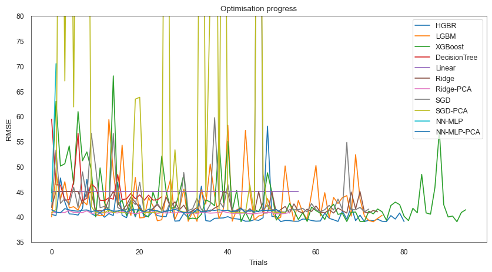
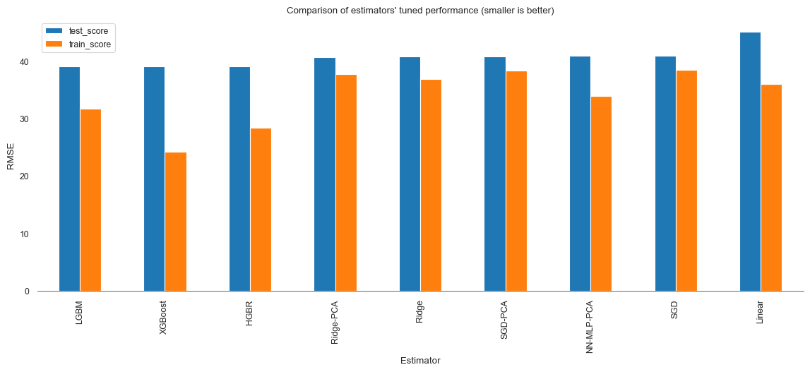
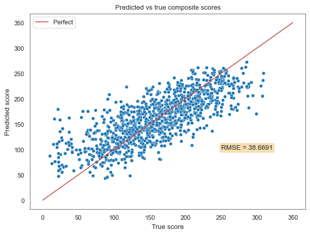
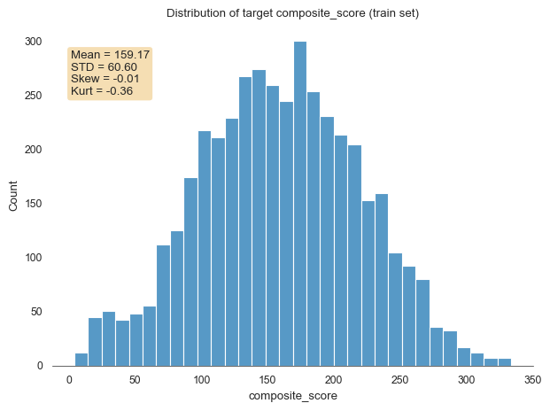
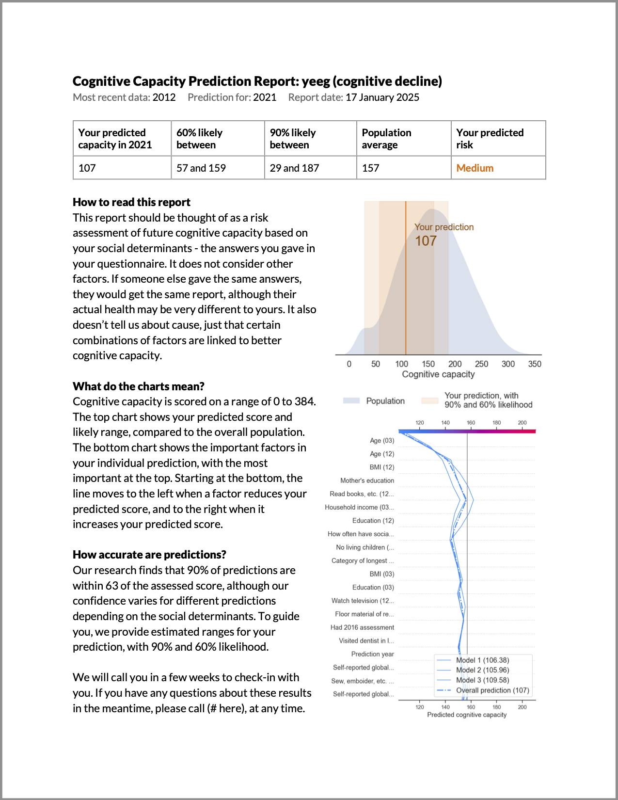

# Predicting Future Cognitive Capacity 

Nick Nettleton, April 2025

Licence: MIT

Following success in the NIH/DrivenData [PREPARE Challenge Competition](https://www.drivendata.org/competitions/group/nih-nia-alzheimers-adrd-competition/), where I ranked second in the Model Arena and won an Explainability Prize, this project builds on that work.

## Lay Summary

The goal of this model is to predict individuals' future cognitive capacity based on [social determinants](https://www.who.int/health-topics/social-determinants-of-health), for early identification of Alzheimer's and Related Dementias. Early detection is crucial, yet current methods of screening are difficult to perform. Models that can flag individuals with a high risk early have the potential to enable early treatment.

I find that we are able to predict cognitive capacity up to 20 years into the future with surprising accuracy based on social determinants alone. I also provide visualisations so people can compare their prediction to the population and understand how their prediction is made: 

## Data

The data used comes from the [Mexican Health and Aging Study](https://www.mhasweb.org/Home/index.aspx), a national longitudinal study of adults 50 years and older in Mexico that has been running since 2001. I use survey data from 2001, 2003 and 2012, and cognitive assessments carried out in-person as part of the [MHAS Cognitive Aging Ancillary Study Waves 1 and 2 (Mex-Cog 2016 and 2021)](https://www.mhasweb.org/DataProducts/AncillaryStudies.aspx)

The MHAS (Mexican Health and Aging Study) is partly sponsored by the National Institutes of Health/National Institute on Aging (grant number NIH R01AG018016) in the United States and the Instituto Nacional de Estadística y Geografía (INEGI) in Mexico. The MHAS Cognitive Aging Ancillary Study Waves 1 and 2 (Mex-Cog 2016 and 2021) were sponsored by the National Institutes of Health/National Institute on Aging (NIH R01AG051158/ R56AG059756).

Further details and links to download the data are given in the [Data Sheet](data_sheet.md).

## Model 

The model comprises:

1. A VotingRegressor ensemble of two, evenly-weighted gradient boosters - LightGBM and XGBoost - for predictive future cognitive capacity. This ensemble was selected after extensive evaluation of 9 different algorthims with different data preparation techniques, based on predictive performance, explainability and speed.

2. A MAPIE (Model Agnostic Prediction Interval Estimator) Regressor for estimating prediction intervals. This is used to provide, with each prediction, a ranges that cognitive capacity is predicted to fall within, with 60% and 90% likelihood. These figures are chosen because they are intuitive for lay users to understand, where 60% means "more likely within this range than not", and 90% means "in nine out of ten cases it will be within this range".  

3. A SHAP (SHapley Additive exPlanations) TreeExplainer to explain and visualise on what basis predictions are made, at both population and individual prediction levels. This is intended to provide transparency into how the model works for both professional and lay users.

For more details on the model, see the [Model Card](model_card.md).

To explore the code, see the Jupyter Notebook: [Cognitive-Capacity-Prediction.ipynb](Cognitive-Capacity-Prediction.ipynb).

## Hyperparameter Optimisation

Hyperparameter optimisation was carried out for all candidate algorthims prior to selecting the highest performers. For some, such as Decision Tree, it was clear after 10 trials that they would not converge to an acceptable performance. These were discarded early. Linear algorthims, such as Ridge Regression, converged to a strong performance within approximately 20 trials. The best performers, the gradient boosters, were selected for further optimisation over 70-100 trials.

The below chart shows the performance (measured in RMSE) for each candidate estimator for each subsequent trial. From this we can see that the optimisation process is still exploring new areas of the search space, and further tuning is likely to find better combination of parameters, but it is likely that the current best performance is close to the best that can be achieved:

Some of these estimators, and in particular the gradient boosters, have many parameters that can be tuned. With each cross-validation run taking approximately 1-10 minutes depending on the estimator, it would not be practical to do this using grid search or random search.

I used Optuna to implement Baysian Optimisation for this process, because it is fast, flexible, and offer a range of advanced functionality. Definining functions for initialising and suggesting new points for each estimator, I made use of constrained hyperparameter optimistion so that appropriate combinations of values are suggested for each experiment where there are dependencies between them. I implemented a process for saving and loading trial history for each estimator so tuning can be warm-started rather than start afresh for each new training run.

The final performance of each candidate estimator in cross-validation post-tuning is shown in the chart below, with best to worst from left to right:

## Results

The final model combines the two best performers, LightGBM and XGBoost, into an ensemble that takes advantage of their relative strengths.

RMSE is used as the primary metric. Evaluated on a test set of unseen data, the model achieved an RMSE of of **38.6691**. This compares to the top ten ranking models in the DrivenData PREPARE Challenge based on the same data, which had RMSE between 38.2030 and 39.0283. The following chart shows the distribution of predicted to ground truth scores for cognitive capacity for each sample in the test set:

Prediction intervals were also appropriate, but potentially too wide: 94.73% of predictions were within the 90% prediction interval, and 81.07% within the 60% prediction interval.

I give more detailed results in the [Model Card](model_card.md). Fully detailed results, together with an analysis of bias, are in the [Notebook](Cognitive-Capacity-Prediction.ipynb).

## Learnings

The degree of accuracy with which we can predict future cognitive capacity based on social determinants is surprising - and potentially concerning. In an ideal world, cognitive capacity would depend on medical factors alone, rather than social ones.

A weakness in the model, which is consequence of the distribution of data, is that predictions for people with very low and very high scores are less accurate than for those towards the centre of the distribution.

This is a problem, because it is exactly these people, with low future scores, that we want to identify.

I am experimenting with techniques to address this, such as training targeted models that prioritise early identification of Alzheimer's rather than overall predictive accuracy. Some approaches are showing promise and I look forward to sharing these in due course.

## Contact details

If you would like to learn more about this and other work, please contact me via https://www.linkedin.com/in/nicknettleton/.

## Example individual prediction explainer report

This example report illustrates how the model output could be communicated to a lay user. The data and charts are generated by the model from a test sample:

## References

'PREPARE: Pioneering Research for Early Prediction of Alzheimer's and Related Dementias EUREKA Challenge', DrivenData.org, https://www.drivendata.org/competitions/group/nih-nia-alzheimers-adrd-competition/

'Social determinants of health', WHO.int, https://www.who.int/health-topics/social-determinants-of-health

MHAS, Mexican Health and Aging Study, (2001, 2003, 2012). Data Files and Documentation (public use): Mexican Health and Aging Study, ([insert Product Name]). Retrieved from  www.MHASweb.org on 12 April 2025. https://www.mhasweb.org/DataProducts/ConstructedData.aspx

Mex-Cog, MHAS Cognitive Aging Ancillary Study, (2016, 2021). Data Files and Documentation (public use): Mex-Cog, (Cognitive Assessment). Retrieved from www.MHASweb.org on 12 April 2025. https://www.mhasweb.org/DataProducts/AncillaryStudies.aspx.

MAPIE - Model Agnostic Prediction Interval Estimator, https://mapie.readthedocs.io/en/stable/

SHAP (SHapley Additive exPlanations), https://shap.readthedocs.io/en/latest/

Optuna: A hyperparameter optimization framework, https://optuna.readthedocs.io/en/stable/index.html

