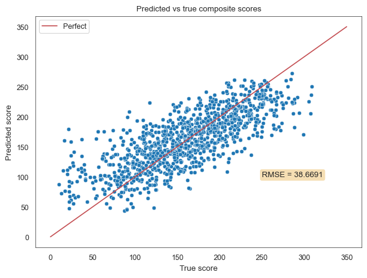
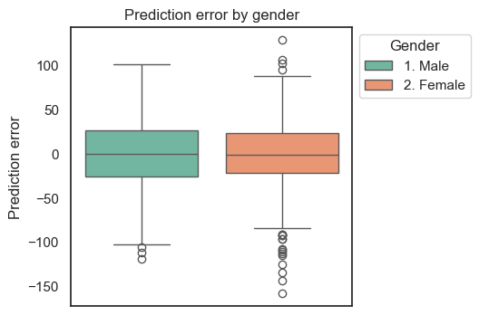

# Model Card: Predicting Future Cognitive Capacity

Model version: v0.3

Date the model card was created/updated: 14 April 2025

Contact information for questions: Nick Nettleton, https://github.com/nicknettleton

## Model Description

The objective of the model is to predict future cognitive capacity based on social determinants, as a risk indicator for Alzheimer's and related dementias.

The social determinants comprise 241 datapoints collected across three surveys carried out by the [Mexican Health & Aging Study](https://www.mhasweb.org/) in 2001, 2003 and 2012.

The target variable is a composite score reflecting cognitive function across seven different domains. It is calculated based cognitive assessments administered in 2016 and 2021 as part of the MHAS [Ancillary Study (Mex-Cog)](https://www.mhasweb.org/DataProducts/AncillaryStudies.aspx). The composite score can be from 0 to 384, where a higher score is better.

Further detail on these datasets is provided in the [data sheet](data_sheet.md).

### Input:

**Training and evaluation:**

For training and evaluation of the model the following inputs are used:

1. The 2001, 2003 and 2012 Constructed Data, Created Variables STATA files. These can be downloaded from https://www.mhasweb.org/DataProducts/ConstructedData.aspx.

2. 2016 and 2021 Cognitive Aging Ancillary Studies (Mex-Cog), Cognitive Assessment STATA files. These can be downloaded from https://www.mhasweb.org/DataProducts/AncillaryStudies.aspx.

**Inference:**

For inference, completed social determinants surveys in the same format as the MHAS 2001, 2003 and 2012 [Constructed Data, Created Variables STATA](https://www.mhasweb.org/DataProducts/ConstructedData.aspx) files should be provided. Each prediction requires at least one of the three surveys; where an individual has completed more than one survey, all surveys for that individual are used to inform the prediction. Together they comprise a total of 241 datapoints.

In the future, the model could be adapted to accept data in variety of formats, to make it more accessible.

### Output

The models outputs are:

1. Predicted composite score for 2016 and 2021
2. 60% and 90% prediction intervals for each prediction
3. SHAP explainer for each prediction
3. Visualisation of an individual's prediction and prediction intervals against the population distribution (estimated from the training data)
4. Visualisation of how the prediction is made, using a SHAP Decision Plot

**Example prediction visualisation**


**Example Decision Plot**


### Modelling approach

The model was developed by evaluating a range of preprocessing techniques, including ordinal and one-hot encoding, imputing, standard scaling, minmax scaling, and PCA, with nine different algorthims: HistGradientBoostingRegressor, LightGBM, XGBoost, CatBoost, Decision Trees, Linear Regression, Ridge Regression, Stochastic Gradient Descent, Multi-Layer Perceptron.

All models were tuned using Optuna with cross validation, and the best performers selected for the final ensemble. The final selected models were LightGBM, XGBoost.

Although strong on predictive accuracy, HistGradientBoostingRegressor was excluded due to a bug in compatibility with SHAP, which is required for explainability.

### Data preparation

Initial data preparation steps are documented in the [data sheet](data_sheet.md).

In the final model, categorical data and missing values are handled directly by the model archicture, and no feature scaling is applied prior to training or inference.

### Model Architecture:

The final model consists of:

**Main estimator**

Prediction of composite score is made by a scikit-learn VotingRegressor ensemble of two, evenly-weighted gradient boosters, selected and optimised using Bayesian Optimisation:

A LightGBM regressor with the tuned hyperparameters:

    boosting_type	    gbdt
    n_estimators	    700
    learning_rate	    0.025726
    num_leaves	        561
    max_depth	        151
    min_data_in_leaf	84
    lambda_l1	        40
    lambda_l2	        75
    min_gain_to_split	7.588221
    bagging_fraction	0.5
    bagging_freq	    1
    feature_fraction	0.7

An XGBoost regressor with the tuned hyperparameters:

    tree_method	        hist
    n_estimators	    1760
    max_depth	        13
    learning_rate	    0.004579
    colsample_bytree	0.258259
    subsample	        0.908364
    reg_alpha	        1.045647
    reg_lambda	        1.207439
    gamma	            6
    min_child_weight	46

**Prediction Intervals**

Prediction intervals are estimated by a MAPIE Regressor wrapped around VotingRegressor ensemble, with ```method="plus"``` and ```cv=5```.

**Explainers**

The model explainations are created by fitting a ```shap.TreeExplainer``` to each gradient booster with ```feature_perturbation="tree_path_dependent"```, and then calculating the overall ensemble SHAP values from these.

## Intended and out-of-scope uses

The model is intended for use in research and population health analysis, by researchers.

It is not intended for use in clinical settings or individual clinical diagnosis.

## Performance

Performance was measured on unseen data: a test set of 1062 samples, representing 20% of the total available data. To an ensure an unbiased measure of performance, the data was split carefully to ensure that individuals with multiple samples were grouped entirely in either the train set or the test set.

Overall model performance was measured using RMSE. The final model achieved an RMSE of **38.6691** on the test set. This compares to the top ten ranking models in the DrivenData PREPARE Challenge based on the same data, which had RMSE between 38.2030 and 39.0283.

The following chart shows the distribution of predicted versus ground truth scores. From this we see that it is most accurate towards the centre of the distribution, with a tendency to predict high for lower scorers, and low for high scorers. 



Prediction intervals are likely unnecessarily wide. I found that on the test set, 94.73% of predictions were within the 90% prediction interval, and 81.07% within the 60% prediction interval. The following chart shows ground truth scores compares to prediction interval for each sample in the test set. The samples are sorted by predicted score, from left to right:


The main protected charateristic in the data is gender. Although there are approximately 50% more females than males in the training data, prediction accuracy was relevatively consistent for both genders. This is a significant improvement over earlier versions of this model, where there was a disparity. This following box plot shows the relative consistency of prediction error between genders:



## Limitations

Key model limitations:

1. Due to imbalance in the data, predictions for low-scorers are significantly less accurate than for the population as a whole. For example, for those with scores over one standard deviation below the mean, RMSE is 55.2136. In experiments I have found that this can be improved by training a targeted low-scorer model, but with the comprise of less accurate predictions for the population as a whole.

2. The model is currently configured to predict cognitive capacity in 2016 and 2021 based on 2001, 2003 and 2012 survey data. It would be valuable to build on this by experimenting with a model that can be generalised to predict for any window of 5-20 years into the future based on data collected at any point.

3. The model is currently trained on the MHAS data, which exclusively covers the Mexican population. It is unknown how effectively this might generalise to other populations. It would be valuable to explore the global perspective.

## Trade-offs

The key trade off in the model is the current focus on overall population RMSE at the expense of sensitivity to early detection of very low scorers, due to imbalance in data. I have experimented with SMOTE and SMOGN techniques to increase the training data for low scorers, but this has not yet yielded good results.

Several further steps could be planned to address this:

1. Explore fairness metrics for use in regression - analogous to classification fairness metrics such as sensitivity, demographic parity, equalised odds
2. Source more data for low scorers
3. Explore oversampling and undersampling techniques to address data imbalance
4. Continue to explore synthetic data approaches

